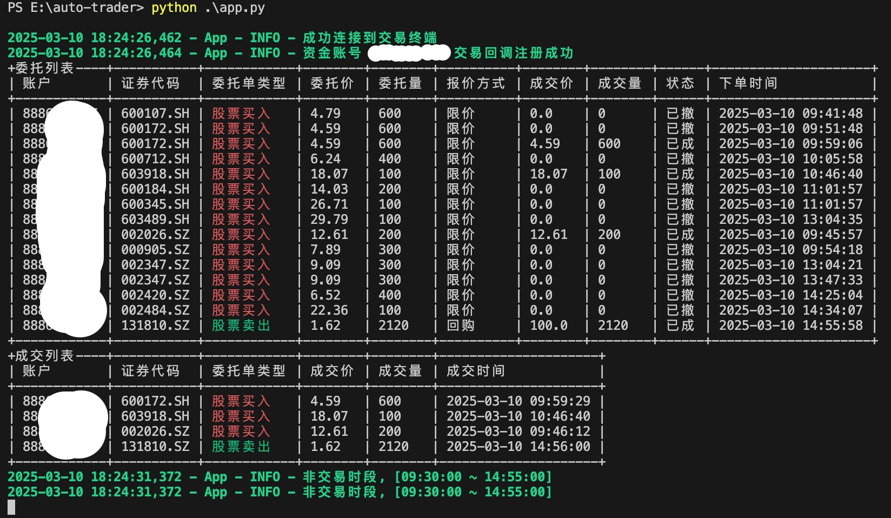

# Auto trader for Mini QMT

> 功能说明:  
> 本程序在用户选定的股票池中，利用Mini QMT推送数据，实时监控股价，在股票上板的一瞬间，进行排单。  
> 通过外挂数据，支持策略自定义

## 1. 开通QMT

可以找国金证券的蒋总 (微信号: jiang985529) 开通QMT，并安装。  
目前该程序也是在国金的QMT上做开发和测试的。

## 2. 下载&安装python

下载地址: <https://www.python.org/downloads/>

## 3. 下载&安装迅投xtquant

下载地址: <https://dict.thinktrader.net/packages/xtquant_240613.rar>

将xtquant_240613.rar解开后复制到 <python安装目录>/Lib/site-packags/ 目录下

## 4. 安装其它依赖包

打开windows控制台，输入: pip install pandas terminaltables3 simple_chalk colorama apscheduler pytz

## 5. 运行Mini QMT

记得登录界面，勾选 "独立交易", 登录QMT

## 6. 修改配置文件 `config.py`

```py
# QMT安装路径 - 根据实际情况自行修改
QMT_PATH = "C:\\gj_trader\\userdata_mini"
# 资金账号 - 根据实际情况自行修改
QMT_ACCOUNT_ID = "XXXXXXX"
# 这个不要修改，固定是STOCK
QMT_ACCOUNT_TYPE = "STOCK"
```

## 7. 运行auto-trader

在运行打板程序之前，先把`候选标的`维护到`stocks.csv`文件中, 栏位 `证券代码` 是必须要有的

```csv
证券代码,证券名称,5涨,10涨,20涨,30涨,45涨,60涨
603918.SH,金桥信息,-0.66,-14.5,13.6,50,32.6,21.8
000536.SZ,华映科技,3.79,11.1,11.7,34.7,26.7,-1.63
```

打开windows控制台，输入: python app.py



## 8. 策略条件定制

打开 `strategy.py`, 在 buy 函数里面添加 你自己的逻辑

```py
...

######################################################################
#      定制条件从这里开始 - 你的策略逻辑应该都写在这里                      #
######################################################################

# 例如:
#   1. 可以看一下stocks.csv里面的有个栏位叫`5涨`, 那么我们就可以增加一个“5日涨幅大于20%终止打板”的条件
if detailed_info.get("5涨") > 20:  # type: ignore
    print(chalk.red(f"{stock_code} 5日涨幅大于30%, 终止打板"))
    return

#   2. 例如：增加一个封单金额条件必须大于1000万才进行打板
if quote.bid1 * quote.bid_vol1 < 10000000.0:
    print(chalk.red(f"{stock_code} 封单金额小于1000万，终止打板"))
    return

#   3. 再举个例子：假设csv里面有个栏位叫`自由流通股本`，
#      那么你可以通过 quote.volume * 100 / detailed_info.get("自由流通股本") 计算换手率,
#      通过换手率参数来判断要不要继续打板

#   4. XtQuant.XtData 提供很多数据接口，你也可以在这里调用这些模块，计算各种指标用于辅助判断
#      https://dict.thinktrader.net/nativeApi/xtdata.html?id=XM8JiS

#   5.  等等，你可以写很多条件在这里，自由发挥，只要有数据，一切皆有可能

############################ 定制条件结束 ###########################

...
```

## 9. Enjoy it 😁

> 免责声明:  
> 本程序仅供学习交流使用，在实盘中使用本程序造成的投资上(不仅限于)的任何损失与程序作者无任何关系, 同意才能使用  
> 运行本程序即同意上述免责声明

Made with ♥ by 满仓干
